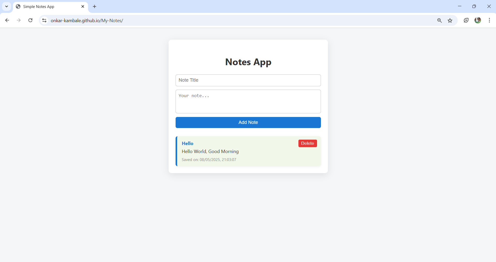

# 📝 Simple Notes App

A simple, fully functional web-based notes app!  
Create, save, view, and delete notes with a title and timestamp - all in your browser, with no backend required.

---

## ✨ Features

- 🆕 **Create Notes:** Add notes with a title and content.
- 💾 **Save Locally:** Notes are stored in your browser’s localStorage and persist between sessions.
- ⏰ **Timestamp:** Each note displays the date and time it was saved.
- 🗑️ **Delete Notes:** Remove notes instantly with a single click.
- 📱 **Responsive Design:** Works well on desktop and mobile devices.

---

## 🛠️ Usage

- **Add a Note:**  
  Enter a title and your note, then click **Add Note**.
- **View Notes:**  
  All saved notes appear below the form, showing their title, content, and saved date/time.
- **Delete a Note:**  
  Click the **Delete** button on any note to remove it.

> ⚠️ **Note:** All notes are stored locally in your browser. Clearing your browser data will remove your notes.

---

## 📸 Screenshots

---

## 🧩 Customization Ideas

Feel free to modify the styles or add new features!  
Some suggestions:
- ✏️ Edit notes
- 🔍 Search/filter notes
- 📤 Export/import notes

---

##  🌐 Deployed

https://onkar-kambale.github.io/My-Notes/

---
